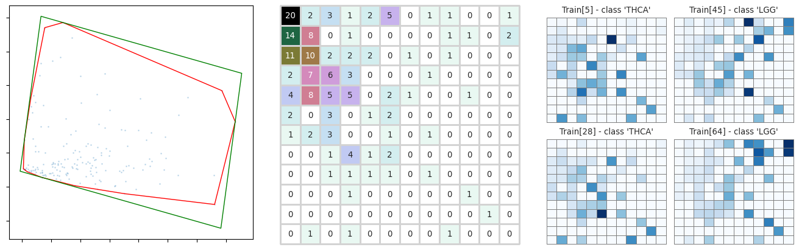
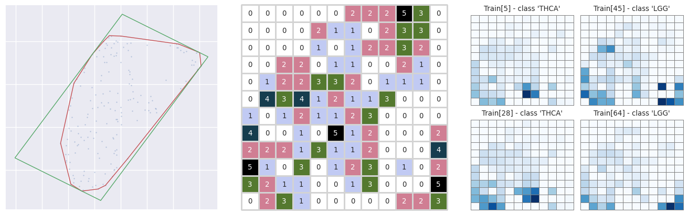
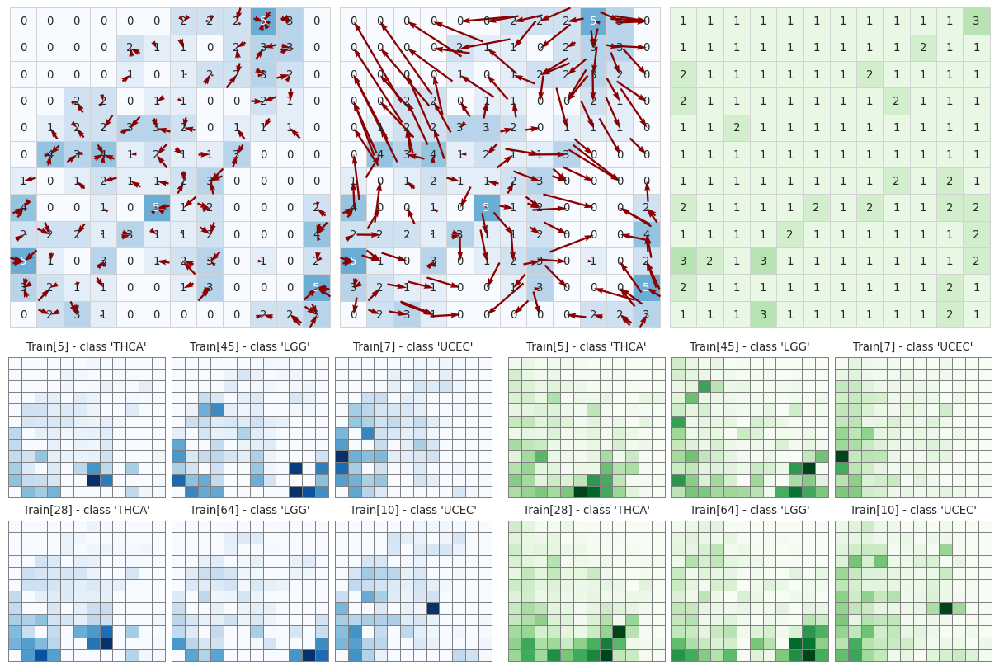

# pyDeepInsight
This package provides a python implementation of 
[alok-ai-lab/DeepInsight](https://github.com/alok-ai-lab/DeepInsight) as originally 
described in [*DeepInsight: A methodology to transform a non-image data to an 
image for convolution neural network architecture*][di] [\[1\]](#1). This is not guaranteed to 
give the same results as the published MatLab code and should be considered 
experimental.

## Installation
You can install the latest stable release of **pyDeepInsight** from PyPI:
```bash
python3 -m pip install pyDeepInsight
```
If you want the latest development version directly from GitHub:
```bash
python3 -m pip install git+https://github.com/alok-ai-lab/pyDeepInsight.git#egg=pyDeepInsight
```


## Overview
DeepInsight is a methodology to transform non-image data into image format 
suitable for analysis by image-based machine learning, such as convolutional
neural networks (CNNs). pyDeepInsight provides access to these methodologies
via classes.

### Image Transformation
DeepInsight maps high-dimensional biological data onto a two-dimensional grid, 
facilitating the identification of patterns and relationships within the data, 
through machine learning.

#### Feature Topology
Feature transformation can be done using any feature reduction algorithm that 
provides 2D output. Commonly used methods include the following. The these example 
data are 172 randomly selected genes from [TCGA RNA-seq][tcga] processed into a 
12x12 pixel image.

##### PCA
[sklearn.decomposition.PCA][pca]

 
<sub>**Left**: First two PCs, with the convex hull in red and the minimum bounding 
box in green. **Middle**: Density matrix for the number of features mapped to a
given pixel. **Right**: Generated images for a selection of samples.</sub>

##### t-SNE
[sklearn.manifold.TSNE][tsne]


<sub>**Left**: t-SNE embedding vectors, with the convex hull in red and the minimum bounding 
box in green. **Middle**: Density matrix for the number of features mapped to a
given pixel. **Right**: Generated images for a selection of samples.</sub>

##### UMAP
[umap.UMAP][umap]


<sub>**Left**: UMAP embedding, with the convex hull in red and the minimum bounding 
box in green. **Middle**: Density matrix for the number of features mapped to a
given pixel. **Right**: Generated images for a selection of samples.</sub>

#### Pixel Mapping
To reduce feature-to-pixel mapping collisions, alternative discretization methods are
available, such as the linear sum assignment algorithm.


<sub>**Upper-Left**: Default 'bin' discretization of features from the UMAP-embedding 
space to the pixel space, represented by red arrows. The number of features mapped 
to each pixel is shown. **Upper-Middle**: Red arrows indicating the pixel mapping of
each feature using the 'lsa' discretization method. **Upper-Right**: The number of 
features in each pixel after 'lsa' discretization. **Bottom-Left**: Generated images 
for a selection of samples using 'bin' discretization. **Bottom-Right**: Generated 
images for the same selection of samples using 'lsa' discretization.</sub>

### Basic Usage

The DeepInsight method can be used to generate an image per sample

```python
fe = sklearn.manifold.TSNE()
it = pyDeepInsight.ImageTransformer(feature_extractor = fe)
X_img = it.fit_transform(X)
```

Or generate multiple image representations per sample

```python
fe01 = sklearn.manifold.TSNE()
fe02 = umap.UMAP()
mit = pyDeepInsight.MRepImageTransformer(feature_extractor = [fe01, fe02])
X_img = mit.fit_transform(X)
```

## Class API

The pyDeepInsight package provides classes that aid in the transformation of 
non-image data into image matrices that can be used to train a CNN. 

<a id='imagetransformer'></a>
### ImageTransformer Class
Transforms features to an image matrix using dimensionality reduction and 
discretization. See the [TCGA SqueezeNet classification notebook](./examples/pytorch_squeezenet.ipynb) 
for a detailed usage example.

```python
class pyDeepInsight.ImageTransformer(feature_extractor='tsne', 
discretization='bin', pixels=(224, 224))
```

#### Parameters
* **feature_extractor: *{'tsne', 'pca', 'kpca'} or a class 
instance with method 'fit_transform'***    
The string values use the same parameters as those 
described in the [original paper][di]. Providing a class instance is preferred and 
allows for greater customization of the feature extractor, such as modifying 
perplexity in t-SNE, or use of alternative feature extractors, such as [UMAP][umap].
* **discretization: *{'bin', 'qtb', 'lsa', 'sla', 'ags'}, default='bin'***.    
Defines the method for discretizing dimensionally reduced data to pixel coordinates.  
By default, '**bin**', is the method implemented in the [original paper][di] and 
maps features to pixels based on a direct scaling of the extracted features to 
the pixel space.   
The '**qtb**' method introduces more spread in the feature-pixel assignments by
applying a [quantile tranformation][qt] to the feature coordinates prior to assignment.      
***Assignment Solution Methods***    
The following methods first construct a feature to pixel-centroid distance matrix
and then apply a linear assignment solution algorithm to find the minimum total 
distance to assign each feature to a unique pixel. In cases where the number of 
features exceeds the number of pixels, Bisecting K-Means clustering is applied 
to the feature prior to discretization, with *k* equal to the number of pixels.    
The '**lsa**' option uses SciPy's [solution to the linear sum 
assignment problem][lsa].    
The '**sla**' option first extracts the top third of pixel assignments then applies
SciPy's [minimum weight full matching of a bipartite graph][sla].    
The '**ags**' option implements the heuristic method, [Asymmetric Greedy Search][ags]
which can be useful in cases where 'lsa' and 'sla' take too long or do not complete.    
* **pixels: *int or tuple of ints, default=(224, 224)***    
The size of the image matrix. A default of 224 × 224 is used as that is the 
common minimum size expected by [torchvision][tv] and [timm][timm] pre-trained models.

#### Methods
* **fit**(X[, y=None, plot=False]): Compute the mapping of the feature space 
to the image space.
* **transform**(X[, y=None, img_format='rgb']): Perform feature space to image 
space mapping. The ***img_format*** parameter specifies the format of returned image:
'**scalar**' returns a numpy.ndarray of shape (*N, H, W*), '**rgb**' returns a PIL 
compatible numpy.ndarray of shape (*N, H, W, 3*), and '**pytorch**' returns a 
torch.tensor of shape (*N, 3, H, W*).
* **fit_transform**(X[, y=None]): Fit to data, then transform it.
* **pixel**([pixels]): Get or set the image dimensions 
* **inverse_transform**(img): Transform from the image space back to the 
feature space.
* **feature_density_matrix**: Returns the feature-pixel density matrix 
for the image space - the number of features mapped to each pixel.

<a id='mrepimagetransformer'></a>
### MRepImageTransformer Class

Generates multiple image representations per sample using more than one 
dimensionality reduction algorithm as originally described in [*Enhanced analysis of tabular 
data through Multi-representation DeepInsight*][mrep] [\[2\]](#2). See the [Madelon classification 
notebook](./examples/mrep_madelon.ipynb) for a detailed usage example.

```python
class pyDeepInsight.MRepImageTransformer(feature_extractor, 
discretization='bin', pixels=(224, 224))
```

#### Parameters
* **feature_extractor: *A list of class 
instances, each with method 'fit_transform'***    
A list of class instances such as [t-SNE][tsne] or [UMAP][umap].
* **discretization: *{'bin', 'lsa', 'ags'}, default='bin'***.    
See the description for the ImageTransformer parameter for more details.
* **pixels: *int or tuple of ints, default=(224, 224)***    
The size of the image matrix.

#### Methods
* **fit**(X[, y=None, plot=False]): Compute the mapping of the feature space 
to the image space.
* **transform**(X[, y=None, img_format='rgb']): Perform feature space to 
image space mapping.
* **fit_transform**(X[, y=None]): Fit to data, then transform it.

The MRepImageTransformer attribute `._its` is a list of ImageTransformer 
instances through which you can access additional methods, such as 
`inverse_transform()` and `feature_density_matrix()` for each image 
representation.


<a id='camfeatureselector'></a>
### CAMFeatureSelector Class

Extracts important features from a trained PyTorch model using class activation mapping
(CAM) as proposed in [*DeepFeature: feature selection in nonimage data using 
convolutional neural network*][df] [\[3\]](#3). See the 
[TCGA feature selection notebook](./examples/cam_feature_selection.ipynb) for a detailed
usage example.

```python
class DeepInsight.CAMFeatureSelector(model, it, target_layer, cam_method="GradCAM")
```

#### Parameters
* **model: *[pytorch.nn.Module][pytm] class***   
The CNN model should be trained on the output from an ImageTransformer instance. 
The [torchvision.models][tv] subpackage provides many common CNN architectures. 
* **it: *ImageTransformer class***   
The ImageTransformer instance used to generate the images on which the model 
was trained.
* **target_layer: *str or pytorch.nn.Module***    
The target layer of the **model** on which the CAM is computed.
Can be specified using the name provided by [nn.Module.named_modules][pytmname] or a 
by providing a pointer to the layer directly. If no layer is specified, the 
last non-reduced convolutional layer is selected as determined by 
the 'locate_candidate_layer' method of the [TorchCAM][tcam] [\[4\]](#4) package by 
François-Guillaume Fernandez.
* **cam_method**: the name of a CAM method class provided by the 
[pytorch_grad_cam][tgcam] [\[5\]](#5) package by Jacob Gildenblat. Default is "GradCAM".

#### Methods
* **calculate_class_activations**(X, y, [batch_size=1, flatten_method='mean']): Calculate 
CAM for each input then flatten for each class.
* **select_class_features**(cams, [threshold=0.6]): Select features for each class using 
class-specific CAMs. Input feature coordinates are filtered based on activation at same 
coordinates.

## [Example Jupyter Notebooks](./examples)

## References
<a id="1">\[1\]</a>
Sharma A, Vans E, Shigemizu D, Boroevich KA, & Tsunoda T. DeepInsight: A methodology to transform a non-image data to an
image for convolution neural network architecture. *Sci Rep* **9**, 11399 (2019).
https://doi.org/10.1038/s41598-019-47765-6

<a id="2">\[2\]</a>
Sharma A, López Y, Jia S, Lysenko A, Boroevich KA, & Tsunoda T. Enhanced analysis of tabular data through 
Multi-representation DeepInsight. *Sci Rep* **14**, 12851 (2024). 
https://doi.org/10.1038/s41598-024-63630-7

<a id="3">\[3\]</a>
Sharma A, Lysenko A, Boroevich KA, Vans E, & Tsunoda T. DeepFeature: feature selection in nonimage data using 
convolutional neural network, *Briefings in Bioinformatics*, Volume 22, Issue 6, November 2021, bbab297. 
https://doi.org/10.1093/bib/bbab297

<a id="4">\[4\]</a>
François-Guillaume Fernandez. (2020). TorchCAM: class activation explorer. https://github.com/frgfm/torch-cam

<a id="5">\[5\]</a>
Jacob Gildenblat, & contributors. (2021). PyTorch library for CAM methods. https://github.com/jacobgil/pytorch-grad-cam

[di]: https://doi.org/10.1038/s41598-019-47765-6
[tcga]: https://www.cancer.gov/ccg/research/genome-sequencing/tcga
[pca]: https://scikit-learn.org/stable/modules/generated/sklearn.decomposition.PCA.html
[tsne]: https://scikit-learn.org/stable/modules/generated/sklearn.manifold.TSNE.html
[umap]: https://umap-learn.readthedocs.io/en/latest/
[qt]: https://scikit-learn.org/1.5/modules/generated/sklearn.preprocessing.quantile_transform.html
[lsa]: https://docs.scipy.org/doc/scipy/reference/generated/scipy.optimize.linear_sum_assignment.html
[sla]: https://docs.scipy.org/doc/scipy/reference/generated/scipy.sparse.csgraph.min_weight_full_bipartite_matching.html
[ags]: https://doi.org/10.1007/s10878-015-9979-2
[tv]: https://pytorch.org/vision/stable/models.html
[timm]: https://github.com/rwightman/pytorch-image-models
[mrep]: https://doi.org/10.1038/s41598-024-63630-7
[df]: https://doi.org/10.1093/bib/bbab297
[pyt]: https://pytorch.org/
[pytm]: https://pytorch.org/docs/stable/generated/torch.nn.Module.html
[pytmname]: https://pytorch.org/docs/stable/generated/torch.nn.Module.html#torch.nn.Module.named_modules
[tcam]: https://github.com/frgfm/torch-cam
[tgcam]: https://github.com/jacobgil/pytorch-grad-cam
[disi]: https://www.nature.com/articles/s41598-019-47765-6#Sec11

# Citation
```
@ARTICLE{Sharma2019-rs,
  title     = "{DeepInsight}: A methodology to transform a non-image data to an
               image for convolution neural network architecture",
  author    = "Sharma, Alok and Vans, Edwin and Shigemizu, Daichi and
               Boroevich, Keith A and Tsunoda, Tatsuhiko",
  journal   = "Sci. Rep.",
  volume    =  9,
  number    =  1,
  pages     = "11399",
  year      =  2019,
}
```
